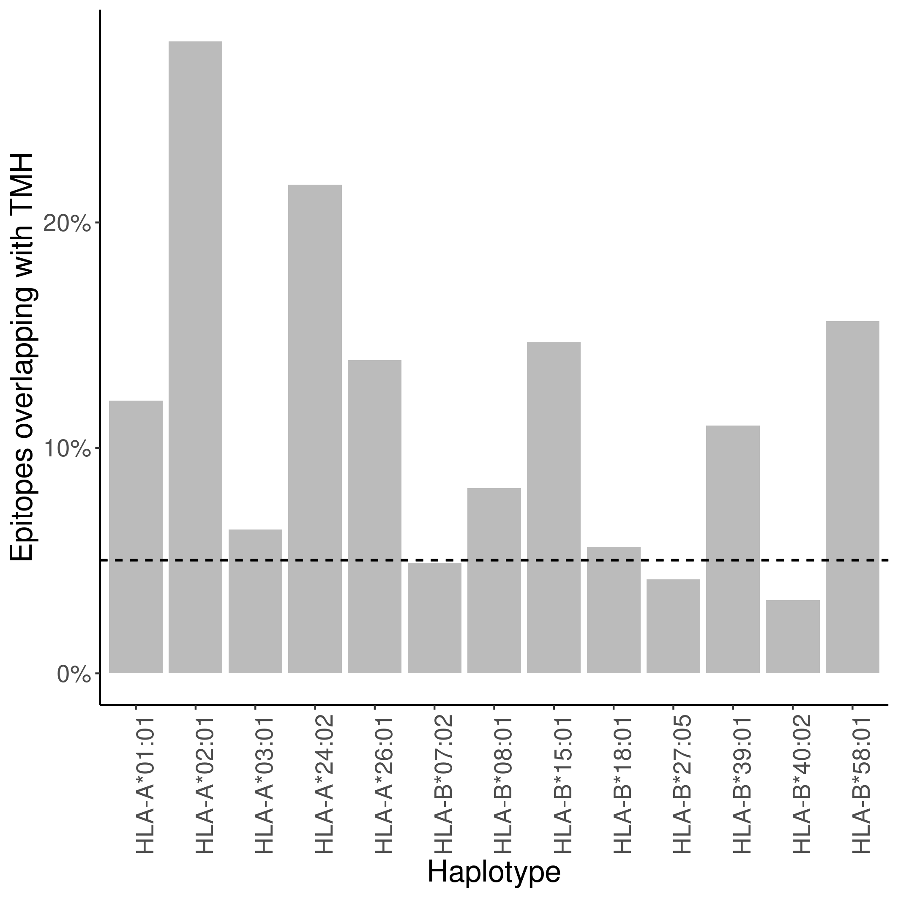
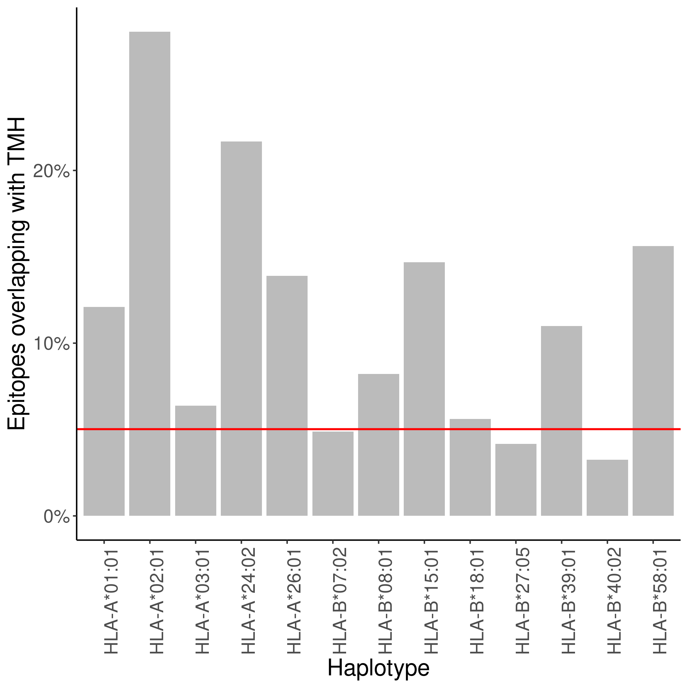
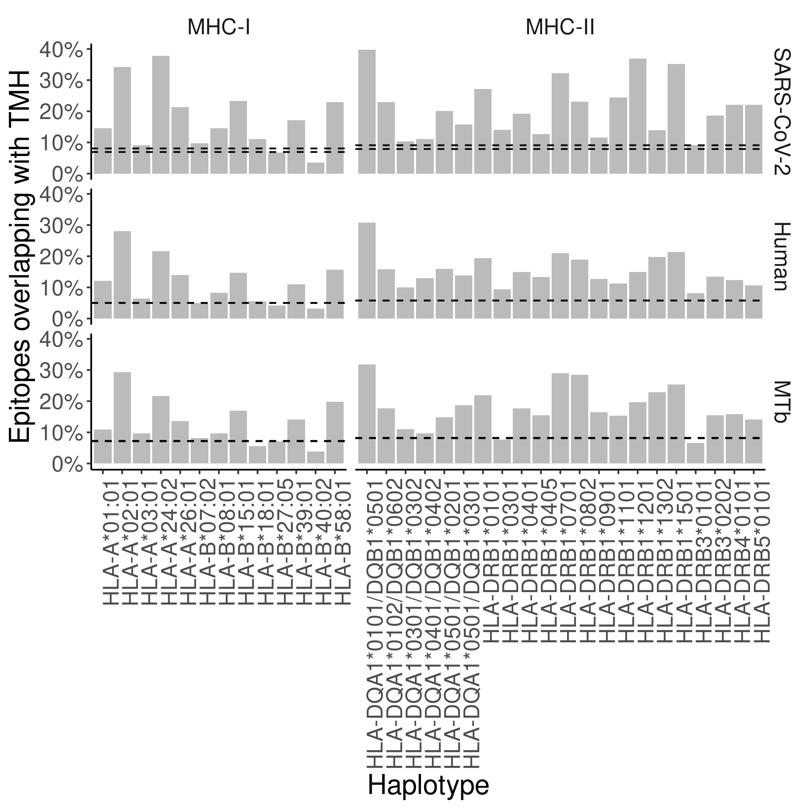
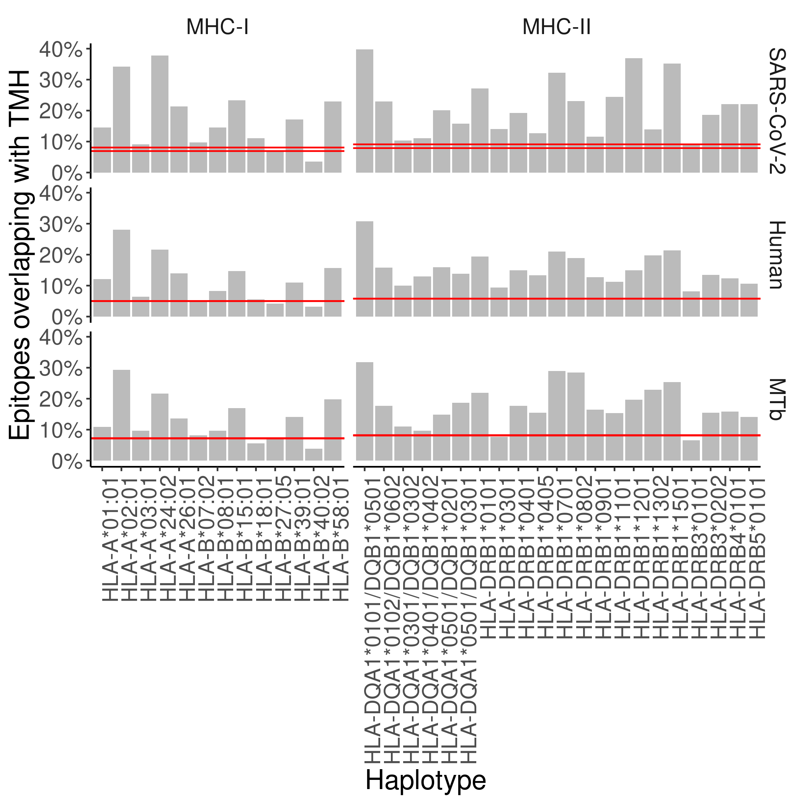
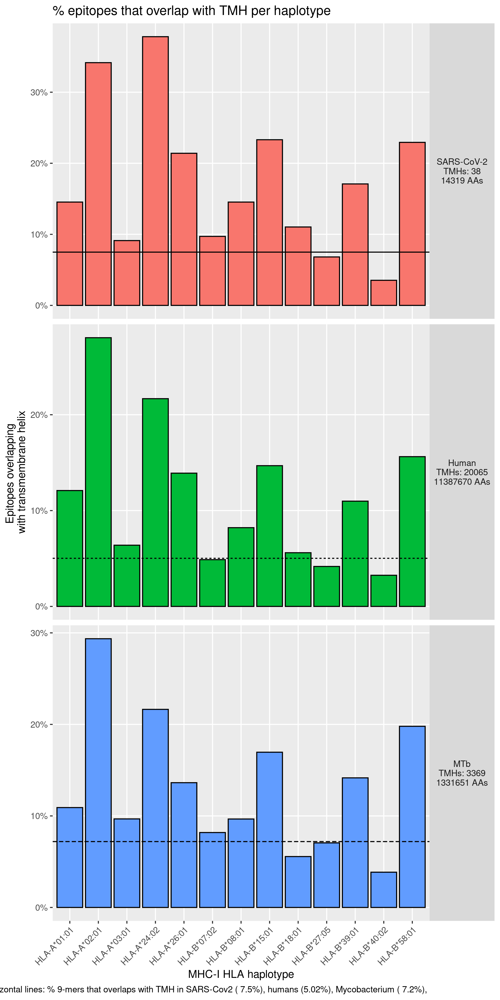
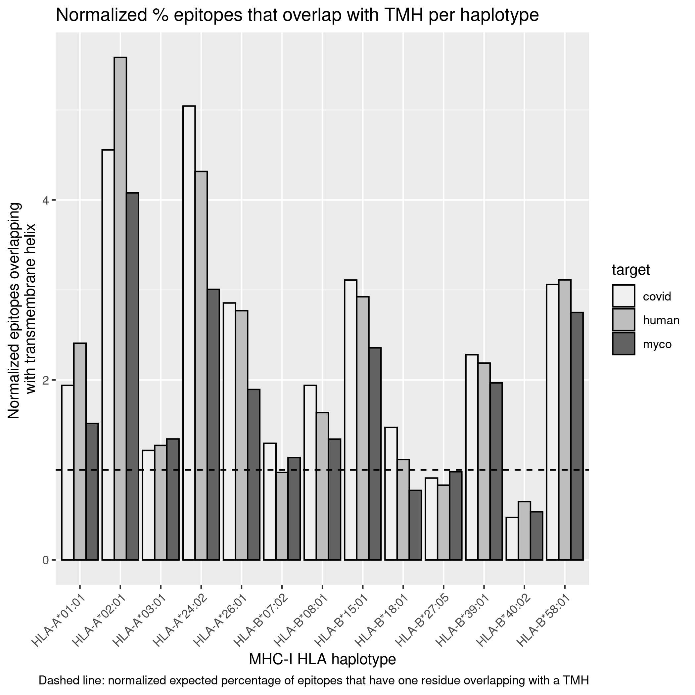
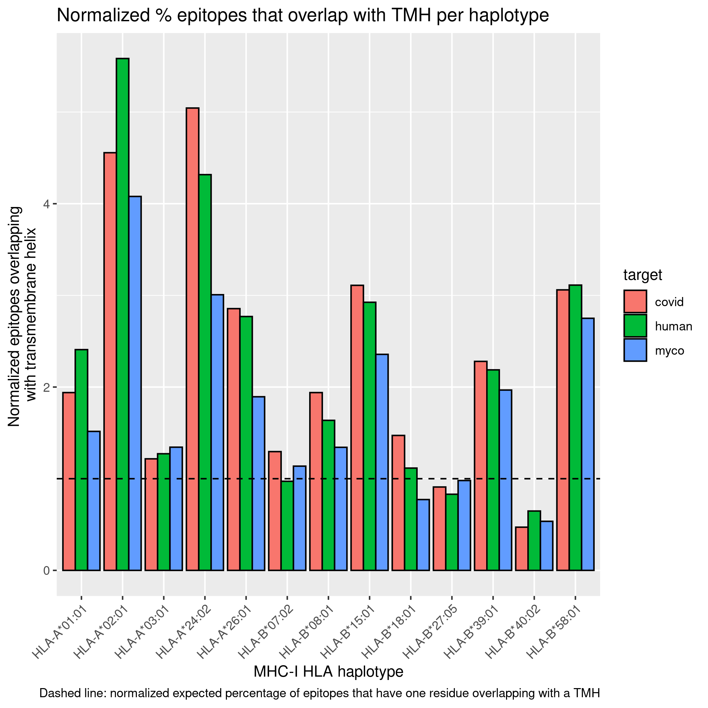
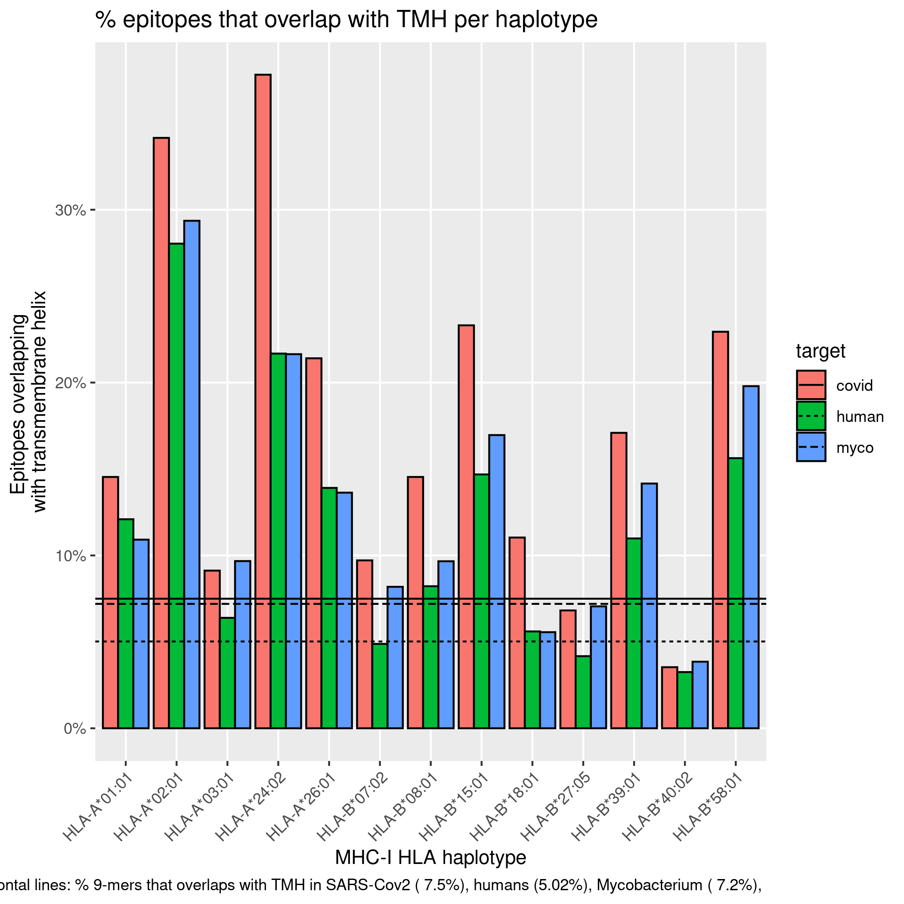
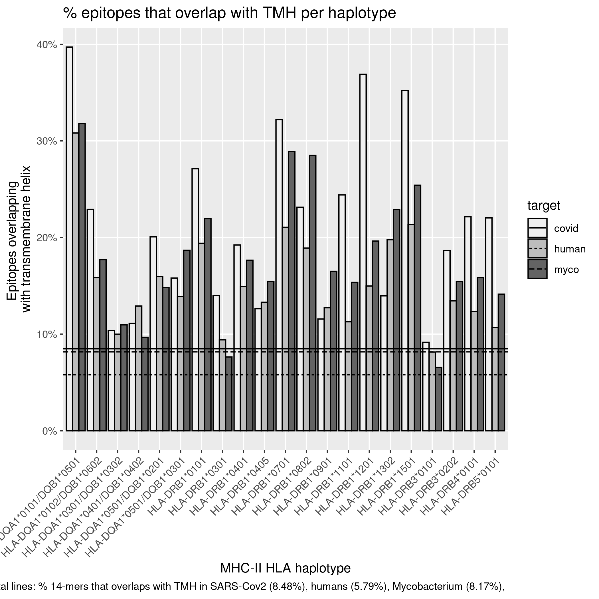
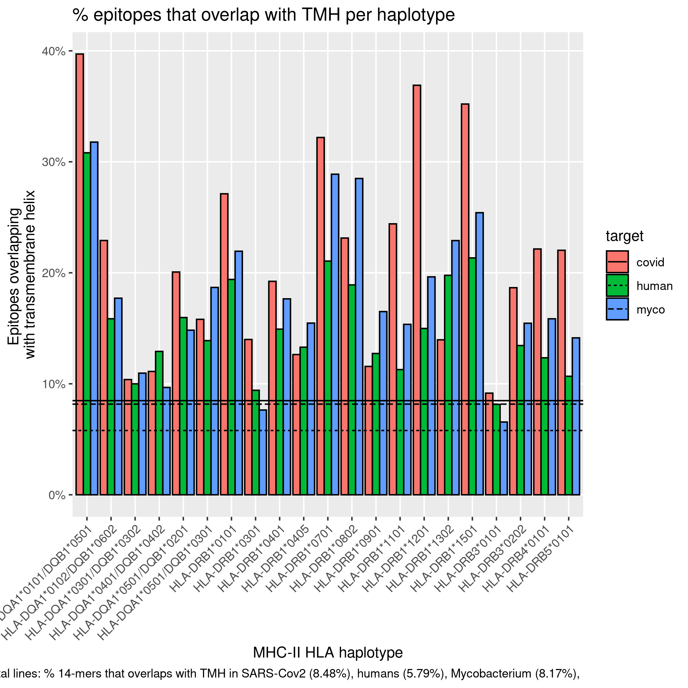

# bbbq_1_smart

Branch   |[](https://github.com/richelbilderbeek/bbbq_1_smart/actions) 
---------|----------------------------------------------------------------------------------------------------------
`master` |
`develop`|

The article 'Transmembrane helices are an overlooked and evolutionarily conserved source of major histocompatibility complex class I and II epitopes',
by Bilderbeek, Baranov, van den Bogaart and Bianchi.

 * [Article GitHub repo](https://github.com/richelbilderbeek/bbbq_article)
 * [Article on biorxiv](https://www.biorxiv.org/content/10.1101/2021.05.02.441235v3)

```
Bilderbeek, Richèl JC, et al. "Transmembrane helices are an overlooked and evolutionarily conserved source of major histocompatibility complex class I and II epitopes." bioRxiv (2021).
```

```
@article{bilderbeek2021transmembrane,
  title={Transmembrane helices are an overlooked and evolutionarily conserved source of major histocompatibility complex class {I} and {II} epitopes},
  author={Bilderbeek, Richèl JC and Baranov, Maxim and van den Bogaart, Geert and Bianchi, Frans},
  journal={bioRxiv},
  year={2021},
  publisher={Cold Spring Harbor Laboratory}
}
```

## Build

```
make
```

## File structure

### `[target]_[percentage]_counts.csv`

`haplotype`   |`name`      |`n_binders`|`n_binders_tmh`|`n_spots`|`n_spots_tmh`
--------------|------------|-----------|---------------|---------|-------------
h1            |p1          |11         |5              |100      |20
h1            |p2          |12         |4              |10       |2

Note that:

 * `n_spots` and `n_spots_tmh` can vary, due to MHC class-dependent epitope lengths.
 * we only keep track of the membrane proteins, `n_spots_tmh` will thus be
   always greater than zero

```
Rscript create_all_counts_per_proteome.R [target] [percentage]
Rscript create_all_counts_per_proteome.R human 5
```

### `counts_[percentage].csv`

`target`|`haplotype_id`|`protein_id`|`n_binders`|`n_binders_tmh`|`n_spots`|`n_spots_tmh`
--------|--------------|------------|-----------|---------------|---------|-------------
covid   |h1            |p1          |11         |5              |100      |20
covid   |h1            |p2          |12         |6              |101      |20

Note that:

 * we only keep track of the membrane proteins, `n_spots_tmh` will thus be
   always greater than zero


```
Rscript merge_all_counts.R [percentage]
Rscript merge_all_counts.R 5
```

### `table_tmh_binders_mhc[mhc_class].csv`

Pretty-printed version

`haplotype`|`covid`      |`human`
-----------|-------------|-------------
HLA-A*01:01| 38.46 (5/13)| 25.00 (5/20)
HLA-B*39:01| 100.00 (2/2)|58.33 (14/24)
HLA-B*40:02|  55.56 (5/9)| 29.17 (7/24)

Note that:

 * up so far, we only kept track of the membrane proteins. 
   Here we correct the percentages to include the full proteome again

```
Rscript create_table_tmh_binders_mhc.R mhc1
Rscript create_table_tmh_binders_mhc.R mhc2
```

## Figures

Note that:

 * up so far, we only kept track of the membrane proteins. 
   Here we correct the percentages to include the full proteome again


















